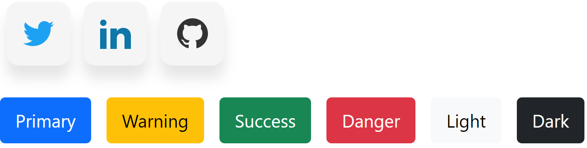
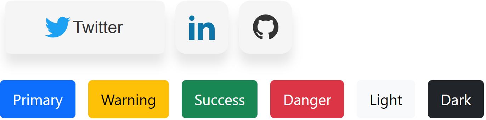

# cns-ui

> Made with create-react-library

[](https://www.npmjs.com/package/cns-ui) [](https://standardjs.com)

## 📦 Install

```bash
npm install  cns-ui
```

```bash
yarn add  cns-ui
```

## 🔨 Usage

```jsx
import { IconButton, Button } from 'cns-ui'
import 'cns-ui/dist/index.css'

const App = () => {
  return (
    <>
        <IconButton text="Twitter" type="twitter"/>
        <IconButton text="Linkedin" type="linkedin"/>
        <IconButton text="Github" type="github"/>
        <Button text="Primary" type="primary"/>
        <Button text="Warning" type="warning"/>
        <Button text="Success" type="success"/>
        <Button text="Danger" type="danger"/>
        <Button text="Light" type="light"/>
        <Button text="Dark" type="dark"/>
    </>
  )
}
```

## ✨ Components Overview





Button has 2 properties.
- Type : {primary, success, warning, danger, light, dark}
- Text : any text.

IconButton has 2 properties.
- Type : {twitter, linkedin, github}
- Text : your social media username


## License

MIT © [cnsbelirdi](https://github.com/cnsbelirdi)
